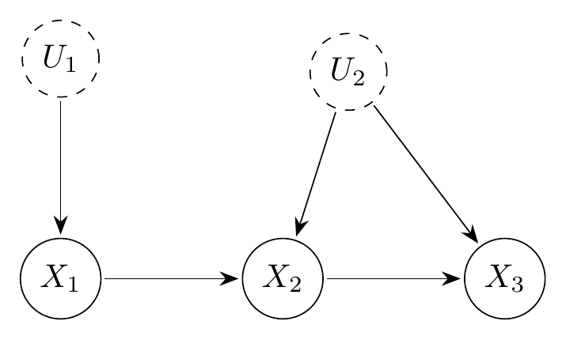

```{r, include = FALSE}
knitr::opts_chunk$set(collapse = TRUE, comment = "#>")
```

```{r setup}
library(igraph)
library(causaloptim)
library(rcdd)
```

# Introduction

When a causal estimand is not identifiable, one can compute sharp bounds by
optimizing over all latent distributions compatible with the observed data.
Sachs et al. (2023) reparameterize the causal model via *response functions*,
yielding a linear program (LP) in $|R|$ variables.
Shridharan and Iyengar (2023) propose an alternative *hyperarc* encoding with
$|H| \le |R|$ variables that gives the same sharp bounds.

This vignette accompanies Markham et al. (2026) and works through the
running example from that paper: the canonical instrumental variable
DAG with $V_L = \{X_1\}$, $V_R = \{X_2, X_3\}$, and an internal edge
$X_2 \to X_3$.  We enumerate $H$ directly---in topological order,
without ever materialising $H_\text{full}$---display all 16 candidate
hyperarcs (marking the 4 invalid ones), and verify that both encodings
give the same sharp bounds.


# Setup

```{r graph-setup}
g <- graph_from_literal(X1 -+ X2, X2 -+ X3, Ur -+ X2:X3) |> initialize_graph()

left_vars  <- names(V(g)[leftside == 1 & latent == 0])
right_vars <- names(V(g)[leftside == 0 & latent == 0])
```

The running example is the confounded DAG below, with $V_L = \{X_1\}$ (the
instrument), $V_R = \{X_2, X_3\}$ (outcomes), a latent common cause $U_2$ of
$X_2$ and $X_3$, and a latent parent $U_1$ of $X_1$.

```{r dag-plot, echo=FALSE, out.width="45%", fig.cap="Confounded DAG. Dashed nodes ($U_1$, $U_2$) are latent."}

```

## Sachs encoding: $|R| = 16$

```{r card-R}
card_R <- prod(sapply(right_vars, function(j) {
  nv <- V(g)[j]$nvals
  pa <- setdiff(names(neighbors(g, j, mode = "in")), "Ur")
  if (length(pa) == 0) nv else nv ^ prod(V(g)[pa]$nvals)
}))
cat("|R| =", card_R, "\n")

## or

cmg <- create_causalmodel(g, prob.form = list(out = c("X2", "X3"), cond = "X1"))
ncol(cmg$counterfactual_constraints$numeric$R)
```


# Direct enumeration of valid hyperarcs

A *valid hyperarc* is a map $h : \mathcal{X}_{V_L} \to \mathcal{X}_{V_R}$ whose
output at each node $j \in V_R$ is constant within every equivalence class of
left-side configurations that share the same values of $j$'s observed parents.
We enumerate $H$ by processing $V_R$ in topological order: at each node we
determine those classes from the assignments already made, then independently
choose a constant value per class.

```{r enumerate-hyperarcs}
enumerate_hyperarcs <- function(graph) {
  obs   <- V(graph)[latent == 0]
  left  <- obs[obs$leftside == 1]
  right <- obs[obs$leftside == 0]

  lvects <- as.matrix(do.call(expand.grid,
    lapply(left$nvals, function(n) 0:(n - 1))
  ))
  colnames(lvects) <- names(left)
  nl <- nrow(lvects)

  right_topo <- names(topo_sort(graph))[
    names(topo_sort(graph)) %in% names(right)
  ]

  H <- list(matrix(nrow = nl, ncol = 0, dimnames = list(NULL, character(0))))

  for (j in right_topo) {
    nv_j   <- V(graph)[j]$nvals
    pa_obs <- names(neighbors(graph, j, mode = "in")) |>
                intersect(c(names(left), names(right)))

    H_new <- list()
    for (h in H) {
      if (length(pa_obs) == 0) {
        groups <- rep(1L, nl)
      } else {
        pmat <- sapply(pa_obs, function(p)
          if (p %in% names(left)) lvects[, p] else h[, p]
        )
        if (!is.matrix(pmat)) pmat <- matrix(pmat, ncol = 1)
        groups <- as.integer(factor(apply(pmat, 1, paste, collapse = "_")))
      }
      combos <- as.matrix(expand.grid(rep(list(0:(nv_j - 1)), max(groups))))
      for (i in seq_len(nrow(combos))) {
        vals  <- as.integer(combos[i, ][groups])
        h_new <- cbind(h, matrix(vals, ncol = 1, dimnames = list(NULL, j)))
        H_new <- c(H_new, list(h_new))
      }
    }
    H <- H_new
  }
  lapply(H, function(h) cbind(as.data.frame(lvects), as.data.frame(h)))
}
```

```{r run-enumeration}
H <- enumerate_hyperarcs(g)
cat("|H| =", length(H), "\n")
```

All 16 candidate hyperarcs (elements of $H_\text{full}$), with validity
indicated, are:

```{r display-hyperarcs, echo=FALSE}
joint <- expand.grid(X2 = 0:1, X3 = 0:1)   # 4 joint outputs

H_full_wide <- do.call(rbind, lapply(seq_len(nrow(joint)^2), function(i) {
  i0 <- ((i - 1L) %% 4L) + 1L
  i1 <- ((i - 1L) %/% 4L) + 1L
  x20 <- joint$X2[i0]; x30 <- joint$X3[i0]
  x21 <- joint$X2[i1]; x31 <- joint$X3[i1]
  valid <- !(x20 == x21 && x30 != x31)
  data.frame(h = i,
    `X2(X1=0)` = x20, `X3(X1=0)` = x30,
    `X2(X1=1)` = x21, `X3(X1=1)` = x31,
    valid = if (valid) "\u2713" else "\u2717",
    check.names = FALSE)
}))

knitr::kable(H_full_wide,
  col.names = c("h", "X2(X1=0)", "X3(X1=0)", "X2(X1=1)", "X3(X1=1)", "Valid"),
  caption   = paste("All 16 candidate hyperarcs.",
                    "The 4 marked \u2717 are invalid (X2 constant but X3 disagrees)."))
```

The 4 invalid candidates (rows 3, 8, 9, 14) are exactly those in which $X_2$
takes the same value for both $X_1$ inputs yet $X_3$ differs: since the
unrealized $X_2$ value is never observed, the two Sachs response functions
that agree on the realized $X_2$ input but disagree on the unrealized one
produce identical observable distributions and collapse into a single valid
hyperarc.

> **Note on Shridharan and Iyengar's construction.**
> Shridharan and Iyengar (2023) define a hyperarc $h$ as *valid* if
> $R_h \neq \emptyset$ (their Definition 4) and give a local checkable
> condition (their Theorem 5) for validity that avoids iterating over $R$.
> $H$ can be constructed by iterating over all
> $|\mathcal{X}_{V_R}|^{|\mathcal{X}_{V_L}|} = 4^2 = 16$ candidate maps
> and retain those satisfying the condition.
> In general, $|\mathcal{X}_{V_R}|^{|\mathcal{X}_{V_L}|}$ can be much larger
> than $|R|$ (when right-side nodes depend on only a subset of $\mathcal{X}_{V_L}$),
> so iterating over the candidate set can be costly.
> The topological enumeration above avoids this: valid hyperarcs are built
> node by node in topological order, so no invalid candidate is ever constructed.


# Verifying identical sharp bounds

Both $R$ and $H$ describe the same observable polytope, so they yield the same
sharp bounds for any causal query.
We verify this for $P(X_3 = 1 \mid \mathrm{do}(X_2 = 1))$.

## Sachs bounds via `causaloptim`

```{r sachs-bounds}
mod          <- analyze_graph(g, constraints = NULL,
                              effectt = "p{X3(X2 = 1) = 1}")
sachs_result <- optimize_effect_2(mod)
sachs_result
```

## Hyperarc bounds

We build the constraint matrix mapping hyperarc weights to the observable
conditional probabilities $p(X_2, X_3 \mid X_1)$, choose the objective vectors
for the query, and call `rcdd::scdd` for vertex enumeration.

The lower-bound objective selects hyperarcs under which $X_3 = 1$ is *certain*
when $X_2 = 1$ (i.e., some $X_1$ value maps to $(X_2=1, X_3=1)$).
The upper-bound objective selects hyperarcs under which $X_3 = 0$ is *impossible*
when $X_2 = 1$.
These are the extreme valid coefficient assignments and yield sharp bounds.

```{r hyperarc-bounds}
rpaste <- function(x) apply(as.matrix(x), 1, paste, collapse = "_")

# All observable (X1, X2, X3) configurations
obs_configs <- as.matrix(do.call(expand.grid,
  lapply(V(g)[latent == 0]$nvals, function(n) 0:(n - 1))
))
colnames(obs_configs) <- names(V(g)[latent == 0])
Pc <- rpaste(obs_configs)

# p-parameter names p{X2}{X3}_{X1}
p_names <- apply(obs_configs, 1, function(r)
  sprintf("p%s_%s",
    paste(r[right_vars], collapse = ""),
    paste(r[left_vars],  collapse = "")))

# Constraint matrix: rows = (normalisation, observables), cols = hyperarcs
# Row 1: sum q_h = 1; Row obs+1: sum_{h: h(x1)=(x2,x3)} q_h = p(x2,x3|x1)
nl        <- nrow(H[[1]])
H_long    <- do.call(rbind, H)
H_strings <- matrix(rpaste(H_long), nrow = length(H), ncol = nl, byrow = TRUE)

Rmat <- 1.0 * Reduce(`|`, lapply(seq_len(nl), function(k)
  outer(Pc, H_strings[, k], FUN = "==")))
Rmat <- rbind(rep(1, length(H)), Rmat)

# Objective: 1 for hyperarcs consistent with X3=1 when X2=1
obj_lower <- sapply(H, function(h)  any(h$X2 == 1 & h$X3 == 1))
obj_upper <- sapply(H, function(h) !any(h$X2 == 1 & h$X3 == 0))

eval_objective <- function(p, y) {
  # Inlined from causaloptim's internal evaluate_objective (c1_num = rbind(1)):
  # y[1] is the constant term; y[-1] are coefficients for the p-parameters.
  const <- as.character(y[1])
  terms <- mapply(function(v, nm) {
    if (v ==  0)  ""
    else if (v ==  1) paste0(" + ", nm)
    else if (v == -1) paste0(" - ", nm)
    else if (v  >  0) paste0(" + ", v, nm)
    else              paste0(" - ", abs(v), nm)
  }, y[-1], p)
  expr <- paste0(const, paste(terms, collapse = ""))
  if (y[1] == 0 && nchar(expr) > 1)
    expr <- trimws(substr(expr, 4, nchar(expr)))
  trimws(expr)
}

enumerate_vertices <- function(Rmat, obj, p) {
  hrep  <- makeH(a1 = t(Rmat), b1 = 1.0 * obj)
  vrep  <- scdd(input = hrep)
  verts <- vrep$output[vrep$output[, 1] == 0 & vrep$output[, 2] == 1,
                       -c(1, 2), drop = FALSE]
  apply(verts, 1, function(y) eval_objective(p, y))
}

hyp_lower <- enumerate_vertices( Rmat,        obj_lower, p_names)
hyp_upper <- enumerate_vertices(-Rmat, -1.0 * obj_upper, p_names)
```

## Symbolic comparison

The two encodings produce the same observable polytope, so vertex enumeration
returns the same set of linear forms in the observed probabilities.
`optimize_effect_2` returns the individual vertex expressions in its
`expressions` field, so we extract them directly for element-wise comparison.

```{r compare}
sachs_lb <- sort(trimws(sachs_result$expressions$lower))
sachs_ub <- sort(trimws(sachs_result$expressions$upper))

hyp_lb   <- sort(trimws(hyp_lower))
hyp_ub   <- sort(trimws(hyp_upper))

cat("Lower-bound expressions identical:", setequal(sachs_lb, hyp_lb), "\n")
cat("Upper-bound expressions identical:", setequal(sachs_ub, hyp_ub), "\n")
```

The shared lower-bound expressions are:

```{r show-lower}
cat(paste(sachs_lb, collapse = "\n"), "\n")
```

That is, the sharp lower bound on $P(X_3=1\mid\mathrm{do}(X_2=1))$ is the
maximum of these linear forms over the observed distribution
$(p_{x_2 x_3 \mid x_1})$, and the two encodings produce exactly this same set.


# References

- Markham, A., Gabriel, E. E., and Sachs, M. C. (2026). Computational and
  algebraic questions in causal inference. In *International Congress on
  Mathematical Software (ICMS)*, Lecture Notes in Computer Science.
  TODO: add DOI/URL

- Sachs, M. C., Jonzon, G., Sjölander, A., and Gabriel, E. E. (2023).
  A general method for deriving tight symbolic bounds on causal effects.
  *Journal of Computational and Graphical Statistics*, 32(2), 567--576.
  <https://doi.org/10.1080/10618600.2022.2071905>

- Shridharan, M. and Iyengar, G. (2023). Scalable computation of causal bounds.
  *Journal of Machine Learning Research*, 24(237), 1--35.
  <http://jmlr.org/papers/v24/22-1081.html>
